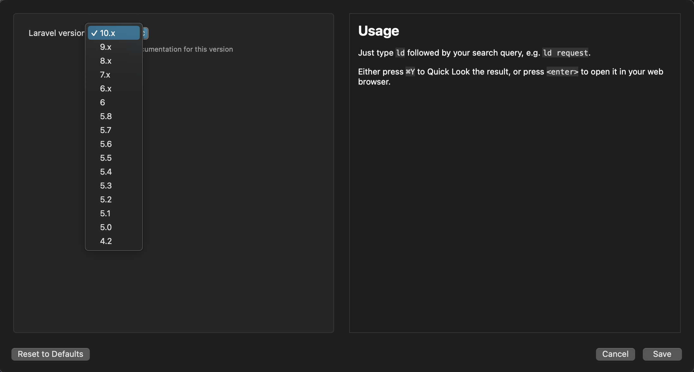

# Laravel Docs Workflow for Alfred


Search the [Laravel documentation](https://laravel.com/docs) using [Alfred](https://www.alfredapp.com/).


## Installation

1. [Download the latest version](https://github.com/techouse/alfred-laravel-docs/releases/latest)
2. Install the workflow by double-clicking the `.alfredworkflow` file
3. You can add the workflow to a category, then click "Import" to finish importing. You'll now see the workflow listed in the left sidebar of your Workflows preferences pane.

## Usage

Just type `ld` followed by your search query.

```
ld request
```

Either press `⌘Y` to Quick Look the result, or press `<enter>` to open it in your web browser.

## Changing the Laravel version to search

The workflow supports searching the documentation of several versions. To change the branch, configure the Workflow as show in the image below.



### Note

Kudos to [tillkruss/alfred-laravel-docs](https://github.com/tillkruss/alfred-laravel-docs) for the initial inspiration.

The lightning fast search is powered by [Algolia](https://www.algolia.com) using the same index as the official [Laravel Docs](https://laravel.com/docs/) website.