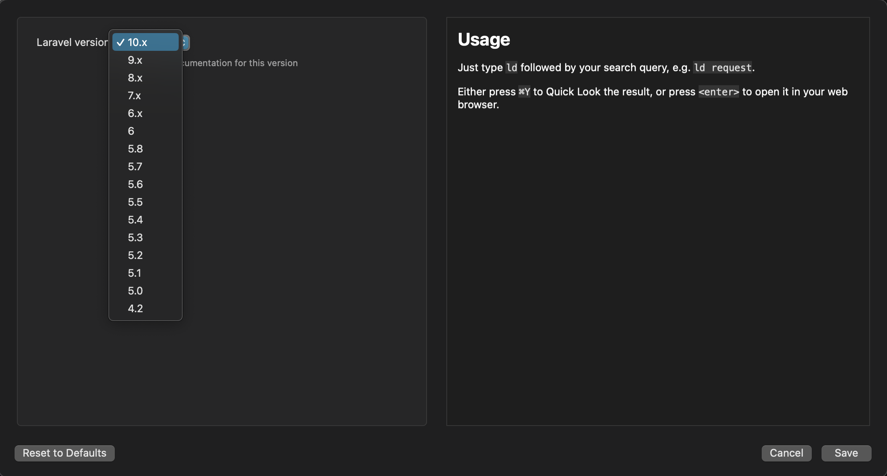

# Laravel Docs Workflow for Alfred


Search the [Laravel documentation](https://laravel.com/docs) using [Alfred](https://www.alfredapp.com/).


## Installation

1. [Download the latest version](https://github.com/techouse/alfred-laravel-docs/releases/latest)
2. Install the workflow by double-clicking the `.alfredworkflow` file
3. You can add the workflow to a category, then click "Import" to finish importing. You'll now see the workflow listed in the left sidebar of your Workflows preferences pane.

## Usage

Just type `ld` followed by your search query.

```
ld request
```

Either press `⌘Y` to Quick Look the result, or press `<enter>` to open it in your web browser.

## Changing the Laravel version to search

The workflow supports searching the documentation of several versions. To change the branch, configure the Workflow as show in the image below.



### Note

Kudos to [tillkruss/alfred-laravel-docs](https://github.com/tillkruss/alfred-laravel-docs) for the initial inspiration.

The lightning fast search is powered by [Algolia](https://www.algolia.com) using the same index as the official [Laravel Docs](https://laravel.com/docs/) website.

## Development

The workflow is implemented in Rust and requires Rust 1.88 or newer. Copy `.env.example` to `.env` and fill in the three Algolia search values, then run a local query with:

```sh
cargo run -- -q "request"
```

Configuration precedence is runtime environment, then the explicit working-directory `.env`, then values embedded at build time. Run the complete local check suite with `make ci`. To build the release directory or create an installable workflow for the current architecture, install `cargo-about` with `cargo install cargo-about --locked --features cli`, then run `make build-release` or `make package`. GitHub releases contain one universal binary supporting arm64 macOS 11+ and Intel macOS 10.15+. The `.env` file is never copied into a package.
